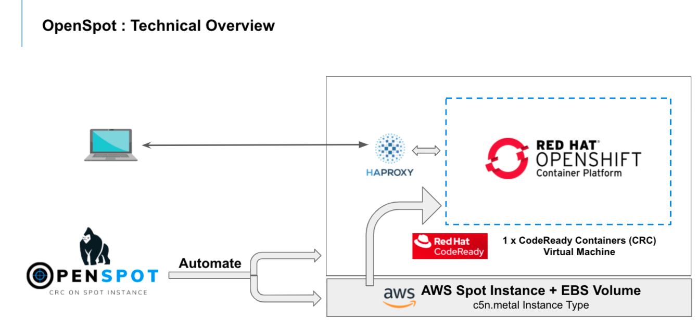

## tldr;
1. Make sure AWS CLI is configured properly with right set of credentials and access to launch resources
2. Execute the following to launch CRC on AWS Spot Instance
```
git clone https://github.com/ksingh7/openspot.git
cd openspot/aws
time bash launch.sh -r ap-south-1 -a ap-south-1a -v false
```
## Preamble
### What is crc
Red Hat CodeReady Containers (CRC) brings a minimal single node OpenShift 4 cluster to your local computer. This cluster provides a minimal OpenShift environment for development and testing purposes. [Read more](https://developers.redhat.com/products/codeready-containers/overview)

### What are Spot Instances
Amazon EC2 Spot Instances let you take advantage of unused EC2 capacity in the AWS datacenter. Spot Instances are available at up to a 90% discount compared to On-Demand prices. [Read more](https://aws.amazon.com/ec2/spot/)
### What is OpenSpot
OpenSpot [Open~~Shift on~~ Spot ~~Instance~~] is a tool that helps you deploy CRC on AWS Spot Instances in a fully automated & resilient manner.
The core idea of openspot is automate all the steps required to launch AWS Spot Instance and automatically configure CRC.
OpenSpot allows you to tear down CRC spot instance and their associated resources, when you do not need it, that translates to further cost saving.

For example : You are a developer/architect, need a CRC environment daily for 4 hours. You can use OpenSpot, launch your CRC environment and terminate after 4 hours, and just repeat this step daily. OpenSpot uses EBS volume to persist your CRC instance, destroying and re-creating OpenSpot instance, do not destroy the CRC VM that you are working on daily (unless you are deleting EBS volume)

##### Features of OpenSpot
- Select Region & AZ of your choice
- Sequentially provision all AWS resources required (as pre-requisite)
  - Key-pair
  - IAM role, policy, instance-policy
  - Security Group
  - user-data as Template
- Launch Spot Instnace
- Configure OS
  - Install all required packages
  - Get CRC/OC binaries
- EBS volume
  - Provision, Attach
  - Detect/Create/Mount filesystem
- CRC Setup
    - Dynamically set CPU/Memory 
    - Expand CRC root disk
- Configure Haproxy & make CRC instance available remotely
- Handle Spot Instance Termination
    - Provision new Spot Instnace 
    - Detect previous instance of CRC and resume that
- Cleanup
  - Destroy all AWS resources requested by openspot


## Setup
### Prerequisite
- AWS CLI must be configured on local machines
- AWS Admin Access & Secret Key
  - If you do not have Admin access, make sure your AWS ID has right capabilites to  provision resources like `IAM roles, policies,instance-policy,key-pair,security group,spot-instance,EBS`
- Test configuration of AWS CLI
```
aws ec2 describe-instances
```
- Get OpenSpot
```
git clone https://github.com/ksingh7/openspot.git
cd openspot/aws
```
## Deploy CRC on Spot Instance

```
    usage launch.sh -r "AWS_Region_Name" -a "AWS_AZ_NAME" -v "true or false"
    OPTIONS
    -r "AWS Region Name : Optional, if not provided, will use AWS CLI default value"
    -a "AWS Availablity Zone Name : Optional, if not provided, will use AWS CLI default value"
    -v "Optional : Verbose Output, set either true or false, default value is false"
    -h "Show help menu"
```
- To launch AWS Spot Instance in `ap-south-1` region and `ap-south-1a` availablity zone, execute
```
time bash launch.sh -r ap-south-1 -a ap-south-1a -v false
```
Sample output
```
$ time bash launch.sh -r ap-south-1 -a ap-south-1a -v false
Need your SSH Public Key absolute path to create AWS Key Pair in the selected Region (ex: /Users/karasing/.ssh/id_rsa.pub) :
Enter SSH Public Key Path [/Users/karasing/.ssh/id_rsa.pub]:
New key-pair named crc-key-pair created in region ap-south-1...
Creating IAM Role ...
Adding policy to IAM Role ...
Creating Instance Profile ...
Adding Role to Instance Profile ...
Creating Security Group ...
Generating User-Data script file ...
Generating Launch Specification file ...
Launching SPOT Instance, Please Wait ...
Please allow 5 minutes for instance configuration
Trying to tail instance setup logs ...
Applying TAG to Instance
Warning: Permanently added '13.232.50.164' (ECDSA) to the list of known hosts.
Installing required packages ... [Done]
Setting up AWS Cli... [Done]
Using existing EBS Volume ...
...
...
Started the OpenShift cluster.

The server is accessible via web console at:
  https://console-openshift-console.apps-crc.testing

Log in as administrator:
  Username: kubeadmin
  Password: kubeadmin

Log in as user:
  Username: developer
  Password: developer

Use the 'oc' command line interface:
  $ eval $(crc oc-env)
  $ oc login -u developer https://api.crc.testing:6443
Setting up HAPROXY on host machine ...
Starting HAPROXY Service ...
========= Post Launch Configuration Completed Successfully ==============
===== You can now Exit from logs tail command by presing Ctrl+C ====
bash launch.sh -r ap-south-1 -a ap-south-1a -v false  
9.87s user 12.99s system 3% cpu 9:55.69 total
```
## Configure Local Machine to remotely connect to CRC Instance
- Automated Instructions for Macos Client to connect to CRC Instance
```
bash aws/mac_client.sh
```
- Manual Instructions for configuring `MacOS` client to connet to remote CRC
```
brew install dnsmasq
mkdir -p /usr/local/etc/dnsmasq.d
touch /usr/local/etc/dnsmasq.d/crc.conf
EIP=$(aws ec2 describe-instances --filters "Name=instance-type,Values=c5n.metal"  --query "Reservations[*].Instances[*].PublicIpAddress" --output=text) ; 
echo "address=/apps-crc.testing/$EIP" > /usr/local/etc/dnsmasq.d/crc.conf ;
echo "address=/api.crc.testing/$EIP" >> /usr/local/etc/dnsmasq.d/crc.conf ;
sudo brew services restart dnsmasq ;
dig apps-crc.testing @127.0.0.1 ;
dig console-openshift-console.apps-crc.testing @127.0.0.1 ;
```
- Login to OC
```
oc login -u kubeadmin -p kubeadmin https://api.crc.testing:6443
oc login -u developer -p developer https://api.crc.testing:6443
```
- Manual Instructions for Linux `Fedora`
```
sudo dnf install dnsmasq

sudo tee /etc/NetworkManager/conf.d/use-dnsmasq.conf &>/dev/null <<EOF
[main]
dns=dnsmasq
EOF

EIP=$(aws ec2 describe-instances --filters "Name=instance-type,Values=c5n.metal"  --query "Reservations[*].Instances[*].PublicIpAddress" --output=text) ; 

sudo tee /etc/NetworkManager/dnsmasq.d/crc.conf &>/dev/null <<EOF
address=/apps-crc.testing/$EIP
address=/api.crc.testing/$EIP
EOF

sudo systemctl reload NetworkManager
```
- Connect to CRC OpenShift running on Spot Instance using OpenShift CLI `oc`
```
Develoer Account
-----------------
oc login -u developer -p developer https://api.crc.testing:6443

# Open OpenShift Console in your local browser
# URL : https://console-openshift-console.apps-crc.testing
# username : developer
# password : developer

Kubeadmin Account
------------------
ssh fedora@$EIP crc console --credentials
# Get oc login command for kubeadmin user
```
  - OpenShift console URL `https://console-openshift-console.apps-crc.testing`
## Destroy your CRC Spot Instance
When you are not using your CRC instance provisioned using OpenSpot, you can destroy that to save cost.

You can choose to destroy just the AWS Spot Instance and keep the EBS volume if you want to restart your CRC instance and resume where you left last time Or you can destroy both Spot Instance and EBS volume.
```
    usage destroy.sh -r "AWS_Region_Name" -a "AWS_AZ_NAME" -d "true or false" -v "true or false"
    OPTIONS
    -r "AWS Region Name : Optional, if not provided, will use AWS CLI default value"
    -a "AWS Availablity Zone Name : Optional, if not provided, will use AWS CLI default value"
    -d "Delete EBS Volume (true or false), default = false"
    -v "Optional, used for verbose output (true or false), default = false"
    -h "Show help menu"
```
- To destroy just the AWS Spot Instance
```
bash destroy.sh -r ap-south-1 -a ap-south-1a -d false -v false
```
- To destroy both AWS Spot Instance and EBS volume
```
bash destroy.sh -r ap-south-1 -a ap-south-1a -d true -v false
```
- Sample Output
```
$ time bash destroy.sh -r ap-south-1 -a ap-south-1a -d false -v false
Deleting CRC resources in Region : ap-south-1 ...
Deleting CRC resources in AZ : ap-south-1a ...
Terminating up Spot Instance ...
Deleting Spot Request ...
Detaching volume
Removing Role from Instance Profile ... [Done]
Deleting Role Policy ... [Done]
Deleting Role ... [Done]
Deleting Instance Profile ... [Done]
Deleting Key Pair ... [Done]
Deleting Security Group... [Done]
bash destroy.sh -r ap-south-1 -a ap-south-1a -d false -v false  
7.08s user 8.30s system 62% cpu 24.693 total
```
## Appendix
- Time calculation
   - Time it takes to launch everything from scratch : ~15 minutes
   - Time it takes to destroy everything  : ~7 minutes
   - Time it takes to launch CRC on existing EBS volume : ~10 minutes

- Cost Calculation
  - AWS Spot Instance cost for c5n.metal instance type : $0.90 / Running Hour
  - AWS EBS cost for 100GB of gp2 : $11.40


- SSH into the instance
```
EIP=$(aws ec2 describe-instances --filters "Name=instance-type,Values=c5n.metal"  --query "Reservations[*].Instances[*].PublicIpAddress" --output=text) ; 
ssh fedora@$EIP
```
- Check progress of Instance setup 
```
ssh  fedora@$EIP cat /var/log/crc_status
ssh  fedora@$EIP tail -f /var/log/crc_setup.log
ssh  fedora@$EIP tail -f /var/log/cloud-init-output.log
```
### Todo
- Add support for GCP preemptible instances
